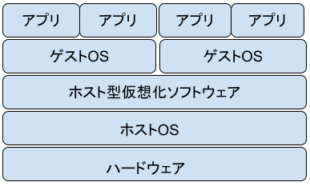
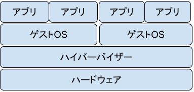
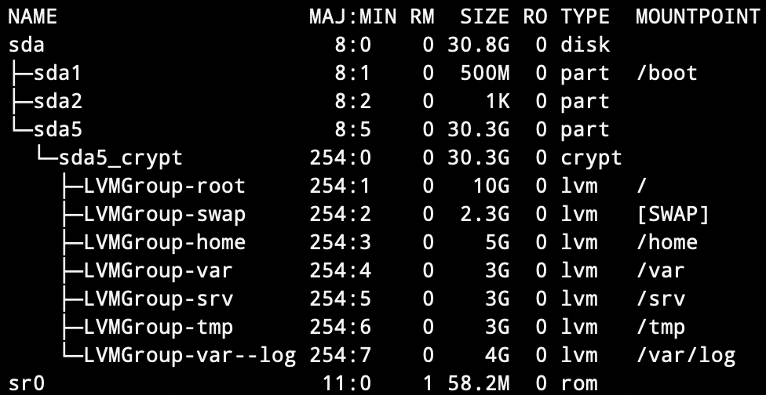
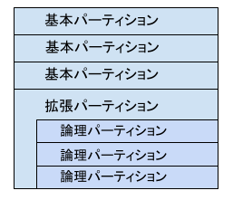

- [Debian 管理者ハンドブック](https://debian-handbook.info/browse/ja-JP/stable/index.html)
- [Debian リファレンス](https://www.debian.org/doc/manuals/debian-reference/index.ja.html)
- [Debian GNU/Linux インストールガイド](https://www.debian.org/releases/stretch/mips/index.html.ja)
- [Debian 10 Buster : ダウンロード](https://www.server-world.info/query?os=Debian_10&p=download)
- [いますぐ実践！Linuxシステム管理](https://www.usupi.org/sysad/)
- [はじめてのLinuxサーバー運用管理](https://shell-mag.com/linux_operations/)
- [世界の電子認証基準が変わる：NIST SP800-63-3を読み解く](https://support.trustlogin.com/hc/ja/articles/115004031154-%E4%B8%96%E7%95%8C%E3%81%AE%E9%9B%BB%E5%AD%90%E8%AA%8D%E8%A8%BC%E5%9F%BA%E6%BA%96%E3%81%8C%E5%A4%89%E3%82%8F%E3%82%8B-NIST-SP800-63-3%E3%82%92%E8%AA%AD%E3%81%BF%E8%A7%A3%E3%81%8F)
- [安全性が高い「SSH」とは？認証方式や使い方をわかりやすく解説！](https://it-trend.jp/encryption/article/64-0057)
- [インフラエンジニアじゃなくても押さえておきたいSSHの基礎知識](https://qiita.com/tag1216/items/5d06bad7468f731f590e)
- [SSHの公開鍵認証における良くある誤解の話](https://qiita.com/angel_p_57/items/2e3f3f8661de32a0d432)
- [cron 【crond】 crontab](https://e-words.jp/w/cron.html)
- [WordPress(ワードプレス)とは？初心者向けに機能やメリット・デメリットを解説](https://digital-marketing.jp/creative/what-is-wordpress/#WordPress-3)
- [VirtualBox で仮想環境のスナップショットを作成・復元する方法](https://nj-clucker.com/virtualbox-snapshot/)
- [Ubuntuサーバーの「コンソールフォント」を変更する方法](https://linuxfan.info/ubuntu-server-change-console-font)

ディスク＝記憶領域

# プロジェクトの概要
このプロジェクトは、仮想化の素晴らしい世界を紹介することを目的としており、VirtualBoxで仮想マシンを設定をします。  
自分のオペレーティングシステムをセットアップできるようになります。

# 仮想マシンとは何か
仮想マシンとは1台のコンピュータで複数のコンピュータを動かす技術のことで、物理的なサーバ機器（マシン）上で「仮想」的に動かすマシンのことです。 物理コンピュータと同じ機能をソフトウェアで実現したコンピュータであり、物理コンピュータと同様にオペレーティングシステムとアプリケーションを実行します。仮想マシンの実体はコンピュータのファイルであり、物理コンピュータ上で実行され、物理コンピュータと同じように動作します。

## 仮想マシンの種類
仮想マシン環境を作り出すソフトには、大きくわけて「ホスト型」「ハイパーバイザー型 」の2つの種類があります。
### ホスト型
ホスト型はハードウェア（サーバ）上のOSに仮想化ソフトウェアをインストールし、仮想化ソフトウェアで仮想マシンを稼働させる方法です。既存のサーバーを使うことができるため、手軽に利用できる点が特徴で検証環境にはよく使われる手法です。  

### ハイパーバイザー型
ハイパーバイザー型はハードウェア（サーバ）上にハイパーバイザーと呼ばれる仮想化ソフトウェアを直接インストールする方式です。仮想マシンはハイパーバイザー上で稼働します。ホストOSが存在しない点がハイパーバイザー型の特徴です。そのため、ホスト型に比べてサーバのリソースをより効率的に利用できます。その一方で新たに専用の物理サーバを用意する必要があります。  

# 仮想マシンが使われる理由
- 仮想マシンは、ウイルスに感染したデータへのアクセスやオペレーティング システムのテストといった、ホスト環境での実行にはリスクの伴う、特定のタスクを実行するために生まれました。仮想マシンはシステムのほかの部分からサンドボックス化されるため、仮想マシン内のソフトウェアはホストコンピューターに変更を加えることができません。
- 物理的に複数のハードウェアを用意する場合、 当然保守点検・人件費・購入費用など運用コストがかかります。しかし、仮想マシンにしてしまえばハードウェアの台数を減らすことができ、運用コストを最小限に抑えることができます。電力も減らすことができますし、スペースもとりません 。
- 仮想マシンを導入していれば、1つのハードウェアで複数を動かすことができるため、新しいシステムの導入時にサーバーを用意する手間が省けるというメリットがあります。
通常新しいサーバを調達するには時間がかかるので、すぐに用意できるというのは非常に便利です。
- 複数のオペレーティングシステムが使えます。例えばWindows上でLinuxを使うことができるため、別のオペレーティングシステムでサービスの確認をしたい時などに便利です。
- 今日ほとんどの場合、コンピューターは潜在的な電力のごく一部しか使用せず、平均的なシステム負荷が低くても動作します。これにより、多くのハードウェアリソースと電力が無駄になります。したがって、部分的にしか使用されていないこのような物理コンピューターを多数実行する代わりに、多数の仮想マシンをいくつかの強力なホストにパックして、それらの間の負荷を分散することができます。

# OSの選択（CentOSとDebianの特徴)
## CentOS
CentOSは業界で最も商業的に成功しているLinuxである Red Hat Enterprise Linux(以下RHEL)系統のクローンOSです。
RHELのソースコードを元に再構築するため、RHELと非常に高い互換性があります。商業ディストリビューションとしてRHELは、デファクトスタンダードでありますが、商品としてのライセンス料金は決して安い価格ではありません。対してCentOSはコミュニティーベースとなるためLinuxサーバーのデファクトスタンダードであるRHELと高い互換性を保ちつつ、費用がかからないのが利点です。  
パッケージ管理システムにYum(Yellowdog Updater Modified)およびその後継のDNF（Dandified Yum）を採用しており、 パッケージ数は約20,000です。

> CentOSは「コミュニティベースで開発されたエンタープライズクラスのオペレーティングシステム (Community ENTerprise Operating System) 」に由来します。

## Debian
Debianは「Debian Project」によって運営されているサービスで、正式名称は「Debian GNU/Linux」です。  
Debianはソフトウェアの簡単なインストール・削除用にパッケージ管理システムを持った初めてのLinuxディストリビューションであり、再インストールせずにシステムの更新ができる初めてのLinux ディストリビューションでした。  
Debian 11にはトータルで5万9,551のパッケージが含まれています。パッケージマネージャのAPT (Advanced Package Tool) により、パッケージの管理を行います。  

> Debian という名前は、2 人のファーストネームを短縮したものです。具体的には Ian Murdock と、当時彼のガールフレンドだった Debra のファーストネームを短縮したものです。Debra と Ian で Debian というわけです。

| パッケージファイル形式 | ディストリビューション           |   パッケージ管理コマンド |
|:----------------------:|:--------------------------------:|:------------------------:|
| Red Hat形式(.rpm)      | Red Hat Enterprise Linux, CentOs | rpm、yumコマンド         |
| Debian形式(.deb)       | Debian GNU, Ubuntu               | dpkg、APT系コマンド      |

# CentOSを選択した場合、SELinuxとDNFとは何か。
Security-Enhanced Linux(セキュリティを強化したLinux)
- [SELinux とは](https://www.redhat.com/ja/topics/linux/what-is-selinux)

# Debian
## パッケージ管理システム
### APT
[APT](https://ja.wikipedia.org/wiki/APT)はDebian用に開発されたコマンドラインベースのパッケージ管理システムであり、[dpkg](https://ja.wikipedia.org/wiki/Dpkg)のフロントエンドとして作動するように設計され、現在では多数のDebian系のLinuxディストリビューションで採用されています。コンパイル済みのソフトウェアを管理する機能に加え、ソースコードからソフトウェアをコンパイルする際の依存関係を解決する機能も備えています。  
APT にはコマンドライン（CUI）で作動するフロントエンドとして apt や apt-get、aptitude が用意されています。
#### 機能
APTでは、コンパイル済みパッケージ（バイナリパッケージと呼ぶ）同士の関係を主に下の4つにわけて管理をしており、これらの関係を用いて、目的のパッケージをインストールするために必要なパッケージもしくは削除する必要があるパッケージを自動計算します。

- 依存  
パッケージを導入するのに欠かすことのできないパッケージ。
- 推奨  
無くてもよいが、プログラムの機能を利用するために通常は導入するパッケージ。
- 提案  
無くてもよいが、導入することによってプログラムの機能を向上させるパッケージ。
- 衝突  
パッケージを導入することで、同一の機能を有するなどの理由で削除されるパッケージ。
### aptitudeとaptの違い
- [6.2. aptitude, apt-get, and apt Commands](https://debian-handbook.info/browse/stable/sect.apt-get.html)
> APTは広大なプロジェクトで、当初の計画にはグラフィカルインターフェイスが含まれていました。これは、コアアプリケーションを含むライブラリに基づいており、apt-getは、プロジェクト内で開発された最初のフロントエンド（コマンドラインベース）です。 aptは、APTによって提供される2番目のコマンドラインベースのフロントエンドで、apt-getの設計ミスをいくつか克服します。  
aptitudeは、APTシステムにおける代表的なコマンドであるapt-getなどに比べて、より強力なパッケージ管理機能（高機能な検索、対話的なソフトウェアの追加・削除ができる）を有しています。例えば、引数を指定せずにaptitudeを起動すると、対話的なCUIインターフェイスでパッケージを管理できます。そしてaptitiudeは外部プロジェクトとして誕生した派生APTになります。  
aptは元々使われていたapt-getに設計上のミスがあり、そのミスを修正した後継APTがaptになり、現在のDebianのAPTではaptコマンドを推奨しています。  
> 知恵袋 -> "平たくいうとapt-get, apt-cache, apt-configと余りにもコマンドを細分化させ過ぎて一般ユーザーがとっつきにくい仕様となってしまった。"  

|         apt-get          |         apt         |        aptitude         |
|:-------------------------|:--------------------|:------------------------|
| apt-get update           | apt update          | aptitude update         |
| apt-get upgrade          | apt upgrade         | aptitude safe-upgrade   |
| apt-get dist-upgrade     | apt full-upgrade    | aptitude full-upgrade   |
| apt-get install package  | apt install package | aptitude install package|
| apt-get remove package   | apt remove package  | aptitude remove package |
| apt-get autoremove       | apt autoremove      | N/A                     |
| apt-cache search package | apt search package  | aptitude search package |
| apt-cache policy package | apt list -a package | aptitude list -a package|
| apt-cache show package   | apt show package    | show package            |
| apt-cache search <regex> | apt search <regex>  | aptitude search <regex> |

# AppArmor
- [アクセスを制限する（AppArmor）](https://shell-mag.com/26th_linuxoperations/)
AppArmor とは、プログラム単位でMAC(Mandatory Access Control - 強制アクセス制御)を行うためのセキュリティシステムです。
MACとは、従来のファイルのパーミッションの設定とは関係なく、強制的にアクセス制限を設けることができるシステムです。
AppArmor では、プログラム毎に、ファイルやソケットなどに対して行うことのできる操作を明示的に指定し、それ以外の操作を行えなくすることができます。これにより、セキュアな環境の構築が可能となります。

AppArmorのセキュリティモジュールは、[LSM](https://ja.wikipedia.org/wiki/Linux_Security_Modules)(Linux Security Modules)というカーネルの機能を利用しています。
LSM とは、Linuxカーネルのセキュリティ・フレームワークです。
Linux には、AppArmor だけでなく、SELinuxやTOMOYO Linuxや、他にもSMACKなどのセキュリティモジュールがあります。
AppArmor では、プログラム毎に設けた制限をプロファイルと呼び、そのプロファイルにはcomplain, enforceの2つのモードがあります。
complainはチェックはするが実際には制限しないモードで、enforceは実際に制限も行うモードです。

`aa-status` もしくは`apparmor_status` コマンドで設定確認できます。(後者は前者のシンボリックリンクです。)

> UNIX系のシステムでは、レガシーなパーミッション(ユーザ、グループとその他)で管理を行ってきました。
> ですが、root の権限は絶対的で、パーミッションを超えてアクセスできてしまいます。また、rootじゃないユーザに少しだけ権限を与えたい、というニーズも増えてきたときにそれらを実現するための技術が開発され、セキュリティに関してより強固で柔軟な設定が行えるようになってきました。
> AppArmor は SUSEや、Debian系のディストリビューションで採用されており、FedoraなどRedHat系のディストリビューションでは SELinux が標準採用されています。

# パスワードポリシー
パスワードポリシーとは，ユーザーアカウントのパスワードに使用できる文字数や，文字種の組み合わせなどに関する条件のことです。
パスワードポリシーを設定することで，推測されやすいパスワードをユーザーが設定することを防ぎ，第三者から不正にアクセスされるリスクを軽減できます。
##### 設定例
- パスワードの最短利用日数
- 定期的なパスワードの変更
- 過去のパスワードと同じパスワードの設定を禁止
- 最低文字数を設定する
- 大文字・小文字・数字・特殊文字を混在させる

#### 有効期限
パスワードの有効期限の要件にはメリットもありますがデメリットもあります。ユーザーは互いに密接に関係している一連の単語と数字で構成される、予測可能なパスワードを選択することになるためです。このような場合、新しく作るパスワードは前のパスワードに基づいて予測することができます。
#### パスワードの長さ
パスワードの長さ要件 (約 10 文字を超える) により、ユーザーの行動が予測可能で望ましくないものとなる可能性があります。たとえば、16 文字のパスワードを使用するよう求められたユーザーは、文字の長さ要件を満たすものの、推測しにくいものではない fourfourfourfour や passwordpassword などの繰り返しパターンを選ぶ可能性があります。さらに、長さ要件は、ユーザーがパスワードを書き留めたり、ドキュメントに暗号化されていないパスワードを保存するなど、他の安全でない手法を採用する機会を増やすことになります。

# partition -> LVM
### パーティションを分割する（ディレクトリー構成）
Linuxが使用するディスク容量が不足すると、リモートからアクセスできなかったり、サーバーが正しく稼働しなくなったりするなど、重大な問題が起こりかねません。サーバーを安定的に運用するには、何らかの対策が必要です。ディスク容量が足りなくなる前に増設することも一つの方法ですが、まずはLinuxの特徴を生かした対策を施しておきましょう。  
  
Linuxでは、ディレクトリーごとに別々のパーティション（ディスク内の区画）を割り当てられます。パーティションを分けておけば、あるパーティションが容量不足になっても他のパーティションへの影響はありません。よって、システムやサーバーの稼働に重要なファイルを格納しているディレクトリーと、容量が肥大化しやすいディレクトリーを、あらかじめ別々のパーティションに分けておくことで、最悪の事態を回避できます。  
> Linuxを構成する各種ファイルは「/」（ルート）というディレクトリーを頂点とする階層化構造で管理されています。ルートの下には「bin/」「etc/」「lib/」などのディレクトリーが存在し、これらの中に用途別に分けられてファイルが格納されています。この階層構造は「Filesystem Hierarchy Standard」（ファイルシステム階層標準、FHS）で定められており、ほとんどのLinuxディストリビューションがFHSに準拠しています。  

しかし、容量不足によるシステムやサーバーアプリの停止は免れても、容量不足に陥っているディレクトリーのサイズを簡単に増やせるわけではありません。新しいハードディスク（HDD）などを追加してより大きなサイズのパーティションを作成し、そのパーティションにディレクトリーの中身を丸ごとコピーした上で割り当てし直す作業が必要です。
### ストレージを柔軟に管理する（LVMの導入）
Linuxには「LVM」（Logical Volume Manager）という仕組みがあります。LVMでは、HDDなどのストレージ内を物理的な区画（物理ボリューム）に分けて、それをいくつか束ねて論理的なストレージとなる「ボリュームグループ」を作成します。このボリュームグループから必要な容量だけを「論理ボリューム」に割り当てられます。この論理ボリュームは、パーティションと同様に扱えます。  
ボリュームグループや論理ボリュームの容量の増減は容易です。容量を増やしたいなら、ボリュームグループに物理ボリュームを追加し、追加したボリュームから必要な容量だけを論理ボリュームに割り当てます。逆に減らしたいなら、論理ボリュームからボリュームグループに容量を戻します。  
また、LVMには「スナップショット」という便利な機能があります。ある時点のLVM上にあるデータの状態を瞬時に保存できます。バックアップ用途にも利用できるのでとても重宝します。  

# LVM(Logical Volume Manager）
- [LVMの環境構築手順](https://qiita.com/hana_shin/items/300f2ed35ea9e9fbd85a)  
LVMは「物理的」なパーティションを細かなブロックに分割し、そのブロックを「論理的」なパーティションとして再構成する仕組みです。
ハードディスクをパーティションで区切るのではなく、あらかじめハードディスクをPEという一定サイズの記憶領域に分け、そのPEを必要な時に必要な分だけ使用します。
LVMを利用することで、複数の物理ディスクからなるボリュームグループを、1つの物理ディスクを超える巨大な論理ボリュームとして利用でき、自由度の高い設定が可能です。
また、論理ボリュームの動的拡大・縮小や、物理的なディスクの追加作業もシステムを停止せずに行えるなど運用面において利点もあります。

  

### PV(physical volume)
物理的な記憶媒体。ハードディスク、SDカード、フロッピーディスクなどがあり、このデバイスは使用可能なストレージを提供します。

### PE(physical extent)
ボリュームグループはPEという単位の集まりとして管理されます。PEの大きさはデフォルトでは4MBです。１つのボリュームグループは最大64個までのPEをもてます。したがってデフォルトでは１つのボリュームグループの大きさは最大で256GBです。PEサイズの設定値の範囲は、8KBから512MBまでです。

### VG(volume group)
複数のPVをまとめるグループです。VGを作成することでPVをまとめて1つの大きな記憶領域として振る舞わせることができます。

### LV(logical volume)
実際にファイルシステムを作る入れ物です。従来のパーティションと対応します。
LVは、PEの集まりで出来ています。そのため、PEサイズの倍数で作成する必要があります。たとえば、PEサイズが32MBだった場合、48MBのLVは作成できません。

### ファイルシステム
ハードディスクやUSB等の記憶媒体上のデータやプログラムは、ファイルと呼ばれる単位で管理されます。このファイルを操作するための仕組みをファイルシステムといいます。通常はパーティション上に作成されますが、LVM環境ではLV上に作成されます。現時点では、「ext4」がLinuxの標準ファイルシステムになります。

## パーティションとは
ハードディスクに設けた仕切りのことを言います。ハードディスクをパーティショニング（パーティションに区切ること）すると、１つのハードディスクを複数のハードディスクがあるかのように扱うことができます。
パーティションを作成することの目的で、もっとも理解しやすい理由は「あるパーティションに何らかのトラブルが生じ、データが消失するなどしても、他のパーティションにはトラブルが波及せずに被害を小さく抑えることができる」というものです。例えば、システム領域とデータ領域を分けておけば、システム領域に何かのトラブルが起こっても、データを置いておく領域が別のパーティションになっていれば、データをトラブルから守ることもできます。また、再フォーマットが必要になった際、トラブルが起きたパーティションのみをフォーマットすることができ、他のパーティションをフォーマットせずに済む、というメリットもあります。
Linuxの場合はメモリのデータを一時的に保存しておく「スワップ領域」が必要となり、このスワップ領域は独立したパーティションとして作成する必要があります。
一旦パーティショニングを間違えると修正することが（できないわけではありませんが）困難なので、Linuxをパーティションを作成するときには注意が必要です。  
  
- 基本パーティション

基本パーティションは、1台のディスクに必ず1つ以上存在する必要がある。
1つの物理ディスクには最大で4つの基本パーティションに分割することができる。
基本パーティションのデバイスファイル名は、SCSIディスク(/dev/sda)の場合、/dev/sda1、/dev/sda2、/dev/sda3、/dev/sda4のようになる。

- 拡張パーティション

基本パーティションのうち、1つだけを拡張パーティションとして使用することができる。
拡張パーティションには、直接ファイルシステムを作成することができない。代わりに、拡張パーティションの中には、論理パーティションが格納される。

- 論理パーティション

論理パーティションは、拡張パーティション内に作成されたパーティションのこと。
作成できる論理パーティションの数は、ハードディスクのタイプにより異なるが、論理パーティションのデバイスファイル名はSCSIの場合、/dev/sda5以降となる。  

[パーティション-wikipedia](https://ja.wikipedia.org/wiki/%E3%83%91%E3%83%BC%E3%83%86%E3%82%A3%E3%82%B7%E3%83%A7%E3%83%B3)  
[Linux基礎(パーティションとファイルシステムの作成)](https://qiita.com/kakkie/items/8f960f2dc5eb6e591d9d)  
[【Linux・CentOS7】 LVM によるディスクの管理について解説](https://go-journey.club/archives/557#LV%EF%BC%88%E8%AB%96%E7%90%86%E3%83%9C%E3%83%AA%E3%83%A5%E3%83%BC%E3%83%A0%EF%BC%89%E3%81%AE%E4%BD%9C%E6%88%90)  
[【Linuxの基礎知識】LVMとは？LVMを理解しよう！](https://www.pmi-sfbac.org/linux-lvm/)  
[LVM とは](https://qiita.com/miyuki_samitani/items/ee3f93fa82d6ada1fa37)  
[Linux技術トレーニング 基本管理コース II](https://users.miraclelinux.com/technet/document/linux/training/2_2_3.html)  

-----

		ex :
		sudo fdisk /dev/sda
		command : p
		Disk /dev/sda: 30.8 GiB, 33071247872 bytes, 64592281 sectors
		Disk model: VBOX HARDDISK
		Units: sectors of 1 * 512 = 512 bytes
		Sector size (logical/physical): 512 bytes / 512 bytes
		I/O size (minimum/optimal): 512 bytes / 512 bytes
		Disklabel type: dos
		Disk identifier: 0x6d84840e

		Device     Boot   Start      End  Sectors  Size Id Type
		/dev/sda1  *       2048  1026047  1024000  500M 83 Linux
		/dev/sda2       1028094 64591871 63563778 30.3G  5 Extended
		/dev/sda5       1028096 64591871 63563776 30.3G 83 Linux

シリンダ番号（StartとEndのところの数値）が隣接している状態なので、この状態でsdc2を拡張したい！ということになっても、そのままでは拡張できず、sdc3を一旦開放してからsdc2を拡張し、その後にsdc3を再度作成みたいなことをしないといけなくなる。ということは、sdc3が使用中だったりすると、その中身を一旦どこかに待避するなどの作業が必要になってしまう訳。

/dev/sda
1番目のSCSI/SATA/USBに接続したHDD

論理パーティションは、 5 から始まる数字で表され、このドライブの第 1 論理パーティションは /dev/sda5 になります。
Linuxでは、１つの物理ドライブ（例えば /dev/sda）を複数の論理ディスクに分割して扱うことが出来ます。この論理的なディスクのことを「パーティション」といい、パーティションの名前は、/dev/sda1, /dev/sda2 のように物理ドライブの名前の後に数字を付けたものになります。
一般的に、パーティションは無制限に作成することが出来ません。通常は、１つの物理ディスクに対して４つのパーティションを作成することができ、これを「プライマリパーティション」といいます。

LVMでは、HDDなどのストレージ内を物理的な区画（物理ボリューム）に分けて、それをいくつか束ねて論理的なストレージとなる「ボリュームグループ」を作成します（図1）。このボリュームグループから必要な容量だけを「論理ボリューム」に割り当てられます。この論理ボリュームは、パーティションと同様に扱えます。

RHEL(Redhat Enterprise Linux) や Fedora, CentOS など、RedHat 系の ディストリビューションをインストールしますと、デフォルトでは、LVM (論理ボリュームマネージャ:Logical Volume Manager)というものを使用 して、パーティションが作成されると思います。
LVM を使用しない場合は、インストールの際にパーティションのサイズを 決めますと、以降はずっとそのサイズのままで使用することになります。
ですが、LVM を使用しますと、パーティションのサイズを動的に変更する ことができます。
たとえば、/home が手狭になってきたときに、HDD を増設して /home の サイズを動的に大きくする、という芸当が、LVM では可能になります。

-----

## SUDO
UNIXおよびUnix系オペレーティングシステムのプログラムの1つで、ユーザーが別のユーザーの権限レベルでプログラムを実行するためのコマンドです。一般的に、ユーザーがスーパーユーザー（superuser、すなわちroot）の特権レベルを利用する際に用いられることが多いです。  
引数として起動したいコマンドやプログラムと、誰の権限で実行したいかを表すユーザー名、挙動を指示するオプションを指定します。パスワード入力が求められるため、自分のパスワード（権限を利用するユーザーのではない）を入力するとプログラムが実行できます。ユーザーの指定を省略すると管理者である「root」ユーザー（スーパーユーザー）を指定したものとみなされます。
誰にどの権限でどのプログラムの実行を許可するかは設定ファイル（通常は/etc/sudoers）に記述されており、管理者がここに記載した以外のユーザーやプログラムの実行は許可されないので誰でも自由にどのような操作も可能なわけではありません。

### sudoを使用する利点
- rootのパスワードを設定しなくてよいので，インストーラーの質問項目を減らせる。
- 大きな変更を加える際、パスワードの入力を求められるようにすることで、ユーザーは何をしようとしているか再認識することができる。
- sudoコマンド実行ログが残り、何か不具合が発生した際にどのようなコマンドを実行したのかを確認することができる。
- rootアカウントでのログインを無効にしている場合、パスワードの総当たりなど、強引な手法でシステムに侵入を試みるクラッカーがrootアカウントで侵入できない。
- sudoを実行できるユーザーをグループで管理できるので，複数の管理者を追加・削除しやすい
- sudo は su に比べて、より細かいセキュリティポリシーを設定することができる。

> sudoコマンドと似た名前のコマンドとして「su」が存在します。こちらは主に別のユーザーに切り替えるためのコマンドで，sudoがsudoコマンドを実行しようとしているユーザーのパスワードを必要とするのに対して，suはsuで切り替える先のユーザーのパスワードが必要です。  

[あなたの人生を少しだけ豊かにするsudoの使い方](https://gihyo.jp/admin/serial/01/ubuntu-recipe/0410)  
[RootSudo - ubuntu documentation](https://help.ubuntu.com/community/RootSudo#Benefits_of_using_sudo)  

## UFW
Uncomplicated(複雑ではない) FireWall  
ufw（Uncomplicated FireWall）とは、Linuxの「Netfilter」によるファイアウォールを管理して操作するためのiptablesをラッパーした機能のことです。  
### netfilter
netfilter とはパケットフィルタリングのモジュールのこと。iptables や firewalld が使用する。  
ネットワークを通過するパケットに対して(1)フィルタ (2)アドレス交換 (3)パケット操作などを行う。  
以下の機能がある。  

・パケット検査・・・パケットに異常がないか検査する  
・PRE ROUTING・・・アドレスを変換する  
・ROUTING・・・他のアドレスに送付する  
・Forward・・・パケットを転送する  
・INPUT・・・自分のプロセスに渡す  
・OUTPUT・・・ネットワークへ送る  
・POST ROUTING・・・外へ出るパケットのアドレス変換  
iptables コマンドで操作を行う。
  
- [iptablesが難しいためufwでWEBサーバーのファイアウォール設定](https://qiita.com/shimakaze_soft/items/c3cce2bfb7d584e1fbce)
### ファイアーウォール
ファイアウォールは、ネットワーク上の悪意のあるアクセスをブロックするセキュリティシステムです。「外部からの不正アクセス」や「ネットワーク攻撃」から、内部コンピュータを守るためのソフトウェア・ハードウェア全体を指します。
ファイアウォールは、内部環境と外部環境の中間地点に存在し、コンピューターや内部ネットワークへの不正アクセスを防止しています。内部と外部の唯一の玄関口に設置するのがポイントです。
コンピュータにはポートというデータの出入口があります。データを送受信するときにはポートが開きますが、ファイアウォールはポートを出入りする情報を監視します。
そして不正が疑われる情報が確認されると、ポートを閉じる仕組みです。ポートが閉じると外部からデータを受け取ることができないため、マルウェアなどが入り込もうとした場合でもコンピュータを守れます。
不正な侵入がコンピュータ内部から、外部のコンピュータに対して行われようとするときにもファイアウォールが活躍します。コンピュータがいったんマルウェアに感染してしまうと、勝手に外部にデータを発信してしまうことが多いです。
- アプリケーションゲートウェイ型
- パケットフィルタリング型
- サーキットレベルゲートウェイ型
### iptables
- [iptables](https://ja.wikipedia.org/wiki/Iptables)
- [netfilterとfirewalldとiptablesとnftablesの関係](https://qiita.com/bashaway/items/e405d59d92670fbc5341)
iptablesとは一般的なLinuxに搭載されているパケットフィルタの事だ。
パケットとは、スマホのパケット通信費などでよく出てくるように、ネットワーク上を流れるデータの事だ。パケットフィルタとは、このパケットを選別して、通すものと通さないものを分けるということを意味している。
iptablesは，Linuxでファイアウォールを設定するための標準的なツールです。iptablesの各種モジュールを利用してNetFilterを設定した場合，ファイアウォールとして求められる，ほぼありとあらゆる設定を行うことができます。また，多くの設定方法が存在し，さらにその設定の自由度も高いものです。
ですが，iptablesはその自由度と機能の豊富さから，設定を行うのに専門の知識が必要になります。

## SSH
- [初心者がSSHについて学ぶ](https://qiita.com/shobooon/items/69cc74cd20c8b5b4fe15)
- [SSHとは   ssh1 ssh2について](http://infoseek_rip.g.ribbon.to/hiiro-sou.hp.infoseek.co.jp/unix/tips/ssh.html)
SSHはネットワーク上のコンピュータを遠隔操作するためのプロトコルです。パスワード情報を含めてすべて暗号化されてやり取りが行われるため、安全性が確保されています。  
SSH には SSH1、SSH2 の2種類のプロトコルがあります。SSH1とSSH2は同じ目的で利用されますが、プロトコルとしては別物ですので相互接続性はありません。SSH1には以前、不正なデータを挿入する攻撃 (insertion attack)が可能になってしまうという問題がありましたが、現在では対策が講じられた結果、この攻撃の実現は非常に難しくなっています(「OpenSSH プロジェクトの目標」参考)。したがって、一概にSSH1を使い続けることが危険で、何がなんでもSSH2を使わなければならない、ということはありません。しかし、現在の開発の本流はSSH2にありますので、特別な理由がない限りはSSH1からSSH2に乗り換えたほうが良いでしょう。
従来はtelnetというプロトコルが使われていましたが、データが暗号化されないため問題視されていました。その弱点を克服する目的で作られたのがSSHです。SSHの登場により、現在telnetは使われなくなっています。  
SSHを利用するためには、前提としてSSHプロトコルを使用する為のソフト(例えば、OpenSSHなど)が導入されており、サーバー側で「SSHデーモン」、クライアント側で「SSHクライアント」が起動されている必要があります。  
### SSHの認証方式
- パスワード認証方式
パスワード認証方式はデフォルトの認証方式で、ユーザー名とパスワードでログインする方式。ユーザー名とパスワードは接続先OSのユーザーアカウントの情報が使用される。
- 公開鍵認証方式
公開鍵認証方式は公開鍵と秘密鍵の２つの鍵(キーペア)を使用した接続方式。サーバーに公開鍵、クライアントに秘密鍵を置いて使用する。公開鍵認証を使うとパスワード入力なしでログインする事が可能になる。  
1. 端末側で秘密鍵と公開鍵のペアを作成する
2. 接続する相手のサーバーに公開鍵を設置しておく
3. 端末側で秘密鍵を使って署名（Signature）を作成してサーバーに設置する
4. 通信の際には作成した鍵のペアを照合することで認証を行う
  
## cron
cronとは、多くのUNIX系OSで標準的に利用される常駐プログラム（デーモン）の一種で、利用者の設定したスケジュールに従って指定されたプログラムを定期的に起動してくれるもの。
cron とは、ジョブ（スクリプト）を自動実行するためのデーモンプロセスです。
利用者はcrontab（“cron table”の略）コマンドで実行したいプログラムやコマンド、シェルスクリプトなどと実行日時を指定すると、同名のテキストファイル（crontabファイル）に設定が保存される。システムに常駐するデーモンの一つであるcrond（“cron daemon”の略）がcrontabファイルに書かれたスケジュールに従って、決まった日時に指定されたプログラムを実行する。  
- [デーモン (ソフトウェア)](https://ja.wikipedia.org/wiki/%E3%83%87%E3%83%BC%E3%83%A2%E3%83%B3_(%E3%82%BD%E3%83%95%E3%83%88%E3%82%A6%E3%82%A7%E3%82%A2))

Cron：特定の時間にコマンドを実行できるようにするLinuxタスクマネージャー。特定の時間に実行するコマンドをcronに指示するだけで、いくつかのタスクを自動化できます。たとえば、毎日午前4時にサーバーを再起動する場合、その時間にウェイクアップする必要はなく、cronが自動的に再起動します。  

Wall：現在サーバーに接続しているすべてのユーザーにメッセージを送信するためにrootユーザーが使用するコマンド。システム管理者が、ユーザーのログアウトを引き起こす可能性のあるサーバーの主要な変更について警告したい場合、rootユーザーはwallで警告することができます。

## Wordpress
オープンソースのブログソフトウェアである。PHPで開発されており、データベース管理システムとしてMySQLを利用している（後述のプラグインよりSQLiteでの使用も可能）。単なるブログではなくコンテンツ管理システム (CMS) としてもしばしば利用されている

簡単にいうと、「ホームページの制作ができない人でも、簡単にコンテンツを管理できる仕組み」ということです。
WordPressはもともとブログ構築用のソフトウェアとして生まれたものですが、前述の通り無料であることに加え、Webブラウザでの簡単な操作で誰でも品質の高いWebページが作成できるため、ホームページ作成ツールとして世界中で広く利用されています。HTMLやCSSといった専門的な知識がなくても、まるでMicrosoftのWordなどを使うような簡単な操作感で誰でもホームページの作成ができます。

## lighttpd
高速性の重視される環境に最適化された、安全・高速で標準に準拠し、柔軟であることを指向して設計されたWebサーバである。
他のWebサーバと比較して「メモリ占有量が少ない」「CPU負荷が少ない」などのメリットがあり、高負荷環境に対応しやすくなっています。

- [UbuntuではじめるLinuxサーバー](https://shell-mag.com/portal-linuxserver/)

